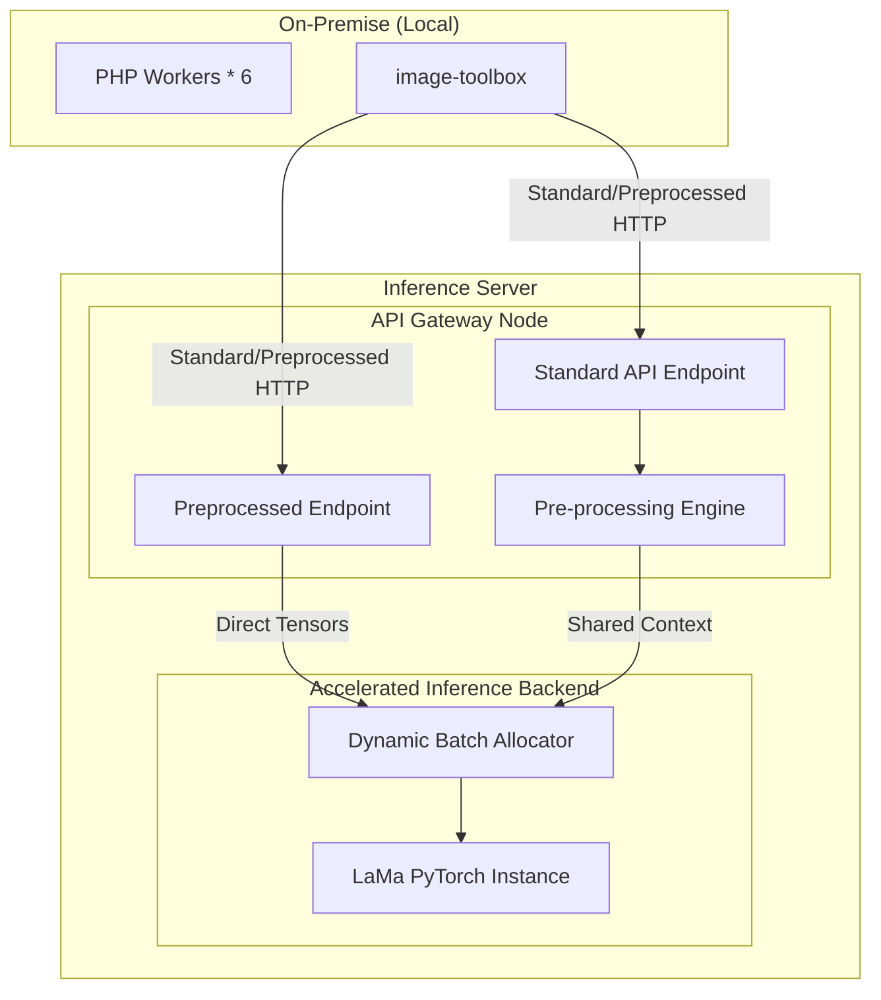

# High-Performance Inference Architecture Blueprint

本文旨在規劃針對大型影像模型優化的特化推理架構，作為 `IOPaint` 在高並發請求下的高效能替代方案，徹底解決現有系統在使用 `IOPaint` 時常見的 GPU 利用率瓶頸與任務排隊積壓問題。

## 1. 系統目標 (System Objectives)
*   **Drop-in Replacement**: 100% 兼容現有 `IOPaint` 的 `/api/v1/inpaint` 介面，業務端無需修改代碼即可切換。
*   **High Throughput**: 透過動態批次處理 (Dynamic Batching) 與非同步排程，消化海量併發任務。
*   **GPU Maximization**: 徹底打破傳統 Python 全域解釋器鎖 (GIL) 限制，提升 GPU 計算單元的活躍度。
*   **Decoupled Architecture**: 隔離 API 路由連接層與重型推理計算層，避免互相阻塞。

## 2. 系統架構圖 (High-Level Architecture)



## 3. 核心組件設計 (Component Details)

### 3.1 Gateway Node
*   **異步處理 (Async I/O)**: 在 Gateway 層級將同步的矩陣運算與 I/O 阻塞呼叫分派至背景線程池，確保主 Event Loop 穩定運行。
*   **連線感知機制**: 實時探測 TCP/HTTP 連線狀態，及時終止已離線客戶端的請求處理，釋放高價值的 GPU 算力。
*   **端點分流設計**: 
    * 提供標準接入點處理全流程解碼與運算。
    * 提供進階接入點接收預先序列化的 Tensor bytes，實現微服務間的零拷貝 (Zero-Copy) 概念，極致降低 Gateway 的 CPU 負擔。

### 3.2 Accelerated Inference Backend
*   **模型後端直通**: 避免複雜的模型計算圖在轉換過程中失真（如動態控制流遺失），原生支援多引擎加載。
*   **Dynamic Batching**: 於 C++ 核心層實作動態張量合併，使零散的併發請求能在微秒級預值內合併為最優矩陣大小進行推論。

## 4. 效能對比與優勢總結

針對 6-Worker 並發任務的 200 張真實測試基準（對比 `IOPaint`）：

| 評估指標 | **本架構方案** | **IOPaint (基準)** | 改善幅度 |
|------|:-----------------:|:-----------:|:-----------:|
| **P50 延遲 (中位數)** | **~1.54s** | ~3.93s | **🏆 快約 2.55 倍** |
| **P99 長尾延遲** | **~1.59s** | ~4.04s | 快約 2.5 倍 |
| **CPU 系統佔用** | **~7.5%** | ~32.2% | **顯著降低 76%** |

透過**動態合批調度**與**端點非同步化**架構，本方案成功在運算資源消耗大幅降低的前提下，將並發任務的吞吐量提升至 IOPaint 的兩倍以上，並從根本上解決了 IOPaint 單執行緒序列化堵塞所導致的長尾延遲 (Long-tail latency) 異常。

## 5. 模組分離結構 (System Layout)

```text
/
├── gateway/                 # 負責網路銜接與前處理
│   ├── app/
│   │   ├── main.py          # API 排程
│   │   └── core/            # 核心邏輯
├── models/                  # 推理引擎庫
│   └── backend_model/
│       ├── config.yaml      # 配置檔
│       └── weights/         # 模型權重
└── deployment/              # 容器編排
```

## 6. 資源配置策略 (Resource Strategy)
*   **Gateway Node**: 配置專屬 vCPU 以提供高頻率的異步 I/O 與影像幾何變換算力。
*   **Inference Engine**: 需要保留足夠的系統記憶體作為 Shared Memory Buffer（加速進程間通訊），並將 VRAM 高效切割提供給並行模型實例。

---
**設計備註**: 此架構將原本 `IOPaint` 的「阻塞序列化」處理模式，徹底轉化為「流水線全非同步」模型，確保吞吐量的最大化而無需更換硬體設備。
