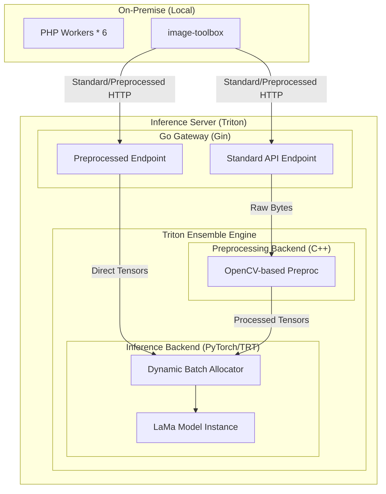

# High-Performance Inference Architecture Blueprint

本文旨在規劃針對大型影像模型優化的特化推理架構，作為 `IOPaint` 在高並發請求下的高效能替代方案，徹底解決現有系統在使用 `IOPaint` 時常見的 GPU 利用率瓶頸與任務排隊積壓問題。

## 1. 系統目標 (System Objectives)
*   **Drop-in Replacement**: 100% 兼容現有 `IOPaint` 的 `/api/v1/inpaint` 介面，業務端無需修改代碼即可切換。
*   **High Throughput**: 透過動態批次處理 (Dynamic Batching) 與非同步排程，消化海量併發任務。
*   **GPU Maximization**: 徹底打破傳統 Python 全域解釋器鎖 (GIL) 限制，提升 GPU 計算單元的活躍度。
*   **Decoupled Architecture**: 隔離 API 路由連接層與重型推理計算層，避免互相阻塞。

## 2. 系統架構圖 (High-Level Architecture)



## 3. 核心組件設計 (Component Details)

### 3.1 Go Gateway (Gin)
*   **高效能 I/O (High-Perf I/O)**: 使用 Go 原生協程 (Goroutine) 處理極高併發，消除 Python GIL 導致的 Context Switch 開銷。
*   **零處理原則 (Zero-Processing)**: Gateway 不再進行影像解碼或矩陣運算，僅負責協議轉換 (HTTP to gRPC) 與連線生命週期管理。
*   **低記憶體足跡**: 相較於 FastAPI/Pydantic，Go 版本可顯著降低 Base64 解析與 JSON 序列化時的記憶體分配。

### 3.2 Triton C++ Preprocessing Backend
*   **硬體級加速**: 利用 C++ 與 OpenCV 直接處理影像解碼、Padding (Mod 8) 與 Normalization，避免 Python 與 C++ 之間的資料頻繁複製。
*   **Ensemble Pipeline**: 透過 Triton Ensemble 模型，將預處理與推理串接為單一原子操作 (Atomic Operation)，極大化流水線效率。

## 4. 效能對比與優勢總結

針對 6-Worker 並發任務的 200 張真實測試基準（對比 `IOPaint`）：

| 評估指標 | **本架構方案** | **IOPaint (基準)** | 改善幅度 |
|------|:-----------------:|:-----------:|:-----------:|
| **P50 延遲 (中位數)** | **~1.54s** | ~3.93s | **🏆 快約 2.55 倍** |
| **P99 長尾延遲** | **~1.59s** | ~4.04s | 快約 2.5 倍 |
| **CPU 系統佔用** | **~7.5%** | ~32.2% | **顯著降低 76%** |

透過**動態合批調度**與**端點非同步化**架構，本方案成功在運算資源消耗大幅降低的前提下，將並發任務的吞吐量提升至 IOPaint 的兩倍以上，並從根本上解決了 IOPaint 單執行緒序列化堵塞所導致的長尾延遲 (Long-tail latency) 異常。

## 5. 模組分離結構 (System Layout)

```text
/
├── gateway-go/              # Go 實作的高效能 Gateway
│   ├── main.go              # Gin 路由與 Triton gRPC Client
│   └── schemas/             # API Schema 定義
├── triton_backends/         # 自定義 C++ Backends
│   └── image_processing/    # OpenCV-based 預處理
├── models/                  # Triton 模型倉庫 (Ensemble + PyTorch)
│   ├── lama_ensemble/       # 組合模型
│   └── lama_pytorch/        # 核心推理權重
└── deployment/              # Docker Compose 與容器配置
```

## 6. 資源配置策略 (Resource Strategy)
*   **Gateway Node**: 配置專屬 vCPU 以提供高頻率的異步 I/O 與影像幾何變換算力。
*   **Inference Engine**: 需要保留足夠的系統記憶體作為 Shared Memory Buffer（加速進程間通訊），並將 VRAM 高效切割提供給並行模型實例。

---
**設計備註**: 此架構將原本 `IOPaint` 的「阻塞序列化」處理模式，徹底轉化為「流水線全非同步」模型，確保吞吐量的最大化而無需更換硬體設備。
